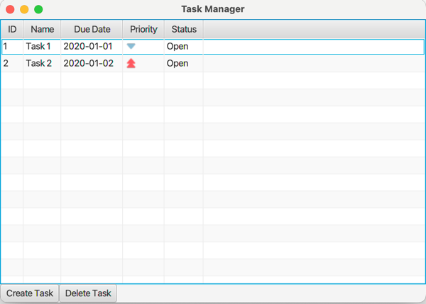

# Task Manager Example

This small JavaFX project is used to demonstrate ViMoTest with a simple GUI consisting of a list of tasks, a create task button and a delete button.

It is intentionally no complete task manager application.

## Start the application

Run `gradlew run` to start the JavaFX application.

## Copy files from ViMoTest

* Navigate to the parent mps-vimotest project directory
* Generate the ViMoTest Sandbox module which contains the task view example
  * either by `gradlew mpsBuild`
  * or by opening the project in MPS and building the sandbox module
* In this taskview-fx project, run `gradlew copyGeneratedSources` and `gradlew copyGeneratedTests`

Note: we checked-in the generated files, such that the project can be demonstrated and the solution can be analyzed without the need to generate the files.
